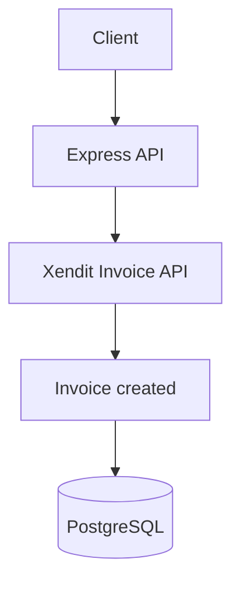
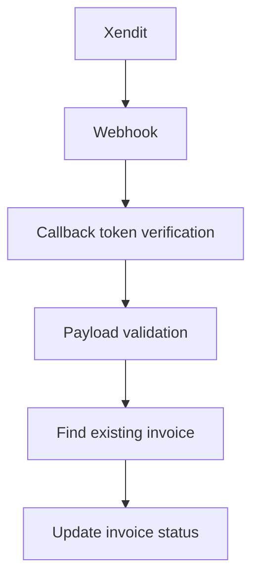

# Xendit Payment API

## Overview

RESTful payment API demonstrating Xendit invoice integration, secure webhook processing, transaction persistence, request validation, automated testing, API documentation, and containerized deployment. This is a backend portfolio project built with Express and TypeScript.

## Features

- Create Xendit invoices and persist them in PostgreSQL
- Fetch invoice status from Xendit and update the local record
- Verify Xendit callback tokens before processing webhooks
- Update existing invoices only; unknown callbacks cannot create records
- Validate requests with Zod and return consistent API errors
- Document endpoints with Swagger UI and test payment flows with mocks

## Architecture





Routes handle HTTP wiring, controllers validate requests, and services coordinate Xendit and Prisma. The `id` returned by Xendit is the invoice primary key; the application's `external_id` is unique as well.

## Tech Stack

Node.js, Express, TypeScript, Xendit Invoice API, Prisma, PostgreSQL, Zod, Mocha, Sinon, Supertest, Swagger UI, Docker.

## Payment Flow

1. `POST /api/payments/create-invoice` validates the request, checks `external_id`, creates the invoice at Xendit, then saves the response locally.
2. The client receives the invoice ID, payment URL, and status.
3. Xendit calls `POST /api/webhook/invoice-callback` when the invoice changes. The API verifies `x-callback-token`, validates the payload, matches both invoice ID and external ID, and updates the existing record.
4. `GET /api/payments/invoice/:id/status` retrieves the current status from Xendit and synchronizes the local record.

Repeated callbacks safely update the same record. An unknown invoice returns `404`; Xendit can retry a callback that arrives before local persistence. A late `PENDING` or `EXPIRED` notification cannot reverse a paid invoice.

## Security

Secrets come from environment variables and are required at startup. Callback tokens are checked before any database access. Zod rejects invalid amounts, identifiers, emails, and callback payloads. Webhooks cannot insert invoices or replace missing fields with placeholder values. Provider errors are translated to safe API responses.

## Setup

Requirements: Node.js 22 LTS and PostgreSQL. Configure the Xendit Invoice webhook URL and verification token in the Xendit dashboard.

```bash
npm ci
cp env.example .env
```

Set `DATABASE_URL`, `XENDIT_SECRET_KEY`, and `XENDIT_CALLBACK_TOKEN` in `.env`. `PORT` defaults to `3000`. `PAYMENT_SUCCESS_REDIRECT_URL` is optional; no redirect URL is sent to Xendit when it is empty. For local development, point `DATABASE_URL` at your local PostgreSQL host rather than Docker's `db` hostname.

```bash
npx prisma generate
npx prisma migrate deploy
npm run dev
```

For a production build:

```bash
npm run build
npm start
```

Run tests without PostgreSQL or Xendit credentials; the suite mocks both boundaries:

```bash
npm test
```

To run with Docker, set the variables in `.env` and use:

```bash
docker compose up --build
```

The container applies committed Prisma migrations on startup. Before applying the unique `externalId` migration to an existing database, resolve any duplicate values; the migration deliberately does not delete data.

## API Documentation

Swagger UI is available at `/api-docs`. It documents create invoice, status lookup, webhook payloads, and expected error responses. Public API JSON uses `snake_case` for invoice fields; Prisma model fields use `camelCase`.
